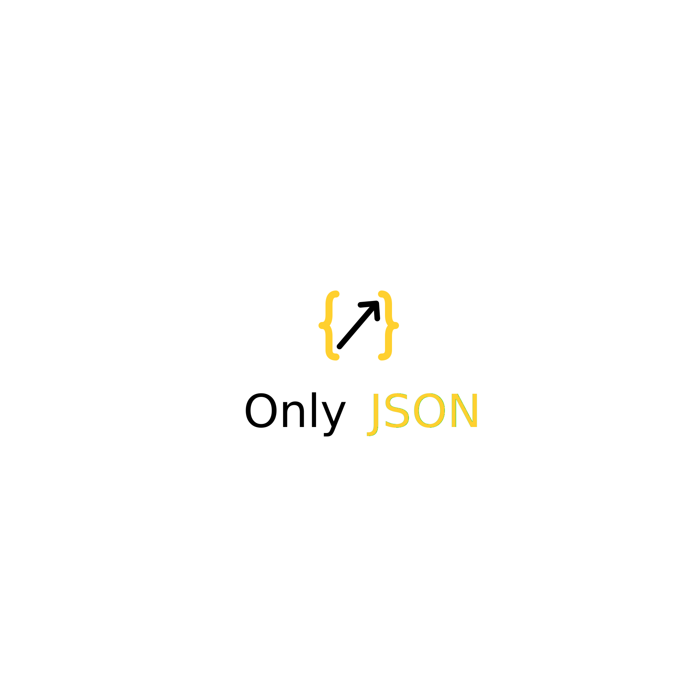

# Only-Json

## Nothing, but only json




## 特点

- 语法现代,像C++原生数据类型一样使用

- 轻量,简洁,单头文件

- 深度兼容STL标准库,并允许手动指定内部使用的容器和内存池

- 无异常(C++ exception)设计,永不抛异常

- 无RTTI,虚函数,std::variant开销

- json对象本身纯栈,无堆上内存托管,string/array/object无间接访问成本

- ~~在和 **nlohmann/json** 一样易用的同时~~ **性能足够**
    - 循环重复10次解析19MB json数据压测
    - 参照组 **nlohmann/json** 成绩为**2.061s**
    - **only-json** 的`json::parse`成绩为**1.278s**
    - **only-json** 带内存池`hai::pool`的成绩为**1.047s**

## 引入

> 共有3个文件

#### header/base.hpp
- 包含`basic_json`对象和DOM json解析器的所有核心逻辑
- 可以正常使用,但需要填写`basic_json`的模板参数

#### header/json.hpp
- **base.hpp** 的包装,提供了`json`,`json_with_pool`等别名,还有一些简单的工具
- `json`是`basic_json`的别名,模板参数传的是STL容器,最易于使用,无缝接入STL生态
    - `basic_json`允许自定义内部使用的各种容器类型,比如`array`,`object`使用什么存储
    - 将base.hpp和json.hpp分离开是让用户可以选择性引入base获得基本功能并自行包装,避免引入过多STL拖慢编译
- `json_with_pool`是带内存池的包装,内部依旧是STL,但模板可传入分配器以提升性能
- `pool`是内置的一个内存池包装
    - 包装的是`std::pmr::monotonic_buffer_resource`使其符合契约
- `leaner_map`是数组包装成的字典,用于`object`
- `""_json`也在里面

#### SAX-parser.cpp
- SAX事件驱动的高性能解析器,DOM的完全重构版,为了极致性能
- 未投入使用(因为不够易用),后续考虑用这个替换掉`basic_json`的内置DOM解析器


## 使用方法

### 初始化

从任何支持的类型初始化

```cpp
json js = "for example, string";
```

嵌套列表初始化

```cpp
json js = {
    {"pi", 3.141},
    {"happy", true},
    {"name", "Niels"},
    {"nothing", nullptr},
    {"answer", {
        {"everything", 42}
    }},
    {"list", {1, 0, 2}},
    {"object", {
        {"currency", "USD"},
        {"value", 42.99}
    }}
};
```

解析初始化  
此语法糖来自json.hpp,会返回一个标准json对象,但不保留解析的错误信息

```cpp
json js = R"(
    {
        "pi": 3.141,
        "happy": true,
        "name": "Niels",
        "nothing": null,
        "answer": {
            "everything": 42
        },
        "list": [1, 0, 2],
        "object": {
            "currency": "USD",
            "value": 42.99
        }
    }
)"_json;
```

从文件解析初始化

```cpp
json js = std::ifstream("./test/1.json");
// 自然,支持赋值为文件
js = std::ifstream("./test/2.json");
```

通过判空检查失败,两种条件等价

```cpp
if (j4==nullptr) {
    return -1;
}
if (j4.type()==json::types::Null) {
    return -1;
}
```

保留错误信息的解析方式,更常用

```cpp
json js;
std::string json_text = R"({"string":123})";
auto [err, idx] = js.parse_from(json_text);
// 检查错误
if (!err.empty()) {
    std::cout<<hai::check_failed_part(json_text, idx);
    return -1;
}
// 或者使用json的parse静态成员函数
auto [js, err1, idx1] = json::parse(json_text);
```

需要注意的是,如果形如这种,会被优先识别成object(构造为object的初始化列表构造函数优先级更高)  
如果想要array,请显式指定

```cpp
j2 = json::array_t {
    {"don't be a object!!!", "test"},
    {"not a key", 123}
};
```

### 使用

初始化为null,在访问中自动创建不存在的键

```cpp
json js; // null
js["pi"] = 3.141;
js["happy"] = true;
js["name"] = "Niels";
js["nothing"] = nullptr;
js["answer"]["everything"] = 42;
js["list"] = { 1, 0, 2 };
js["object"] = { {"currency", "USD"}, {"value", 42.99} };
```

dump序列化

```cpp
std::cout<<js.dump()<<'\n'; // dump成格式化字符串
std::cout<<js.fast_dump()<<'\n'; // 未格式化的字符串(一整行)
```

得到实际对象

```cpp
json js = {1, 2, 3, 4, 5};
// 通过这种方式得到实际对象,可以直接使用
for (int i:js.array()) {
    std::cout<<i<<' ';
}
```

可以通过这些函数获取信息

```cpp
js.type(); // 类型信息,返回json::types强枚举类
// 以下的函数,它们会返回左值引用
js.number_integer();
js.number_floating();
js.number_unsign();
js.boolean();
js.string();
js.array();
js.object();
```

json的类型转换

```cpp
// 转数字
short v = js;
int v = js;
long long v = js;
double v = js;
// 转布尔
bool v = js;
// 转null(转任何指针)
void* v = js;

json::string_t v = js;
json::array_t v = js;
json::object_t v = js;
```

当尝试访问内部数据比如`js.number_integer()`,`js.array()`,或者显式/隐式地将json转为其他类型  
但与此时json类型不匹配时,会产生运行时错误(***only-json panic***,类似于断言直接暂停),并将错误信息以彩色输出到stderr,类似
```
[panic] only-json : type check failed when getting 'object'
```
如果对错误的类型使用了`js["key"]`这类操作运算符
```
[panic] only-json : type check failed (not 'object') when using 'operator[](string key)'
```
如果进行了类型不匹配的转换
```
[panic] only-json : bad conversion to 'number'
```

### 其他操作符

```cpp
js+=1; // 当类型是array时,向末尾加入一个json,相当于push_back
js+={"key", 123} // 当类型是object时,向字典插入一个键值对
```

# 未完...# Only-Json

## Nothing, but only json


## 特点

- 语法现代,像C++原生数据类型一样使用

- 轻量,简洁,单头文件,无依赖

- 深度兼容STL标准库,并允许手动指定内部使用的容器和内存池

- 无异常(C++ exception)设计,永不抛异常

- 无RTTI,虚函数,std::variant开销

- json对象本身纯栈,无堆上内存托管,string/array/object无间接访问成本

- ~~在和 **nlohmann/json** 一样易用的同时~~ **性能足够**
    - 循环重复10次解析19MB json数据压测
    - 参照组 **nlohmann/json** 成绩为**2.061s**
    - **only-json** 的`json::parse`成绩为**1.278s**
    - **only-json** 带内存池`hai::pool`的成绩为**1.047s**

## 引入

> 共有3个文件

#### header/base.hpp
- 包含`basic_json`对象和DOM json解析器的所有核心逻辑
- 可以正常使用,但需要填写`basic_json`的模板参数

#### header/json.hpp
- **base.hpp** 的包装,提供了`json`,`json_with_pool`等别名,还有一些简单的工具
- `json`是`basic_json`的别名,模板参数传的是STL容器,最易于使用,无缝接入STL生态
    - `basic_json`允许自定义内部使用的各种容器类型,比如`array`,`object`使用什么存储
    - 将base.hpp和json.hpp分离开是让用户可以选择性引入base获得基本功能并自行包装,避免引入过多STL拖慢编译
- `json_with_pool`是带内存池的包装,内部依旧是STL,但模板可传入分配器以提升性能
- `pool`是内置的一个内存池包装
    - 包装的是`std::pmr::monotonic_buffer_resource`使其符合契约
- `leaner_map`是数组包装成的字典,用于`object`
- `""_json`也在里面

#### SAX-parser.cpp
- SAX事件驱动的高性能解析器,DOM的完全重构版,为了极致性能
- 未投入使用(因为不够易用),后续考虑用这个替换掉`basic_json`的内置DOM解析器


## 使用方法

### 初始化

从任何支持的类型初始化

```cpp
json js = "for example, string";
```

嵌套列表初始化

```cpp
json js = {
    {"pi", 3.141},
    {"happy", true},
    {"name", "Niels"},
    {"nothing", nullptr},
    {"answer", {
        {"everything", 42}
    }},
    {"list", {1, 0, 2}},
    {"object", {
        {"currency", "USD"},
        {"value", 42.99}
    }}
};
```

解析初始化  
此语法糖来自json.hpp,会返回一个标准json对象,但不保留解析的错误信息

```cpp
json js = R"(
    {
        "pi": 3.141,
        "happy": true,
        "name": "Niels",
        "nothing": null,
        "answer": {
            "everything": 42
        },
        "list": [1, 0, 2],
        "object": {
            "currency": "USD",
            "value": 42.99
        }
    }
)"_json;
```

从文件解析初始化

```cpp
json js = std::ifstream("./test/1.json");
// 自然,支持赋值为文件
js = std::ifstream("./test/2.json");
```

通过判空检查失败,两种条件等价

```cpp
if (j4==nullptr) {
    return -1;
}
if (j4.type()==json::types::Null) {
    return -1;
}
```

保留错误信息的解析方式,更常用

```cpp
json js;
std::string json_text = R"({"string":123})";
auto [err, idx] = js.parse_from(json_text);
// 检查错误
if (!err.empty()) {
    std::cout<<hai::check_failed_part(json_text, idx);
    return -1;
}
// 或者使用json的parse静态成员函数
auto [js, err1, idx1] = json::parse(json_text);
```

需要注意的是,如果形如这种,会被优先识别成object(构造为object的初始化列表构造函数优先级更高)  
如果想要array,请显式指定

```cpp
j2 = json::array_t {
    {"don't be a object!!!", "test"},
    {"not a key", 123}
};
```

### 使用

初始化为null,在访问中自动创建不存在的键

```cpp
json js; // null
js["pi"] = 3.141;
js["happy"] = true;
js["name"] = "Niels";
js["nothing"] = nullptr;
js["answer"]["everything"] = 42;
js["list"] = { 1, 0, 2 };
js["object"] = { {"currency", "USD"}, {"value", 42.99} };
```

dump序列化

```cpp
std::cout<<js.dump()<<'\n'; // dump成格式化字符串
std::cout<<js.fast_dump()<<'\n'; // 未格式化的字符串(一整行)
```

得到实际对象

```cpp
json js = {1, 2, 3, 4, 5};
// 通过这种方式得到实际对象,可以直接使用
for (int i:js.array()) {
    std::cout<<i<<' ';
}
```

可以通过这些函数获取信息

```cpp
js.type(); // 类型信息,返回json::types强枚举类
// 以下的函数,它们会返回左值引用
js.number_integer();
js.number_floating();
js.number_unsign();
js.boolean();
js.string();
js.array();
js.object();
```

json的类型转换

```cpp
// 转数字
short v = js;
int v = js;
long long v = js;
double v = js;
// 转布尔
bool v = js;
// 转null(转任何指针)
void* v = js;

json::string_t v = js;
json::array_t v = js;
json::object_t v = js;
```

当尝试访问内部数据比如`js.number_integer()`,`js.array()`,或者显式/隐式地将json转为其他类型  
但与此时json类型不匹配时,会产生运行时错误(***only-json panic***,类似于断言直接暂停),并将错误信息以彩色输出到stderr,类似
```
[panic] only-json : type check failed when getting 'object'
```
如果对错误的类型使用了`js["key"]`这类操作运算符
```
[panic] only-json : type check failed (not 'object') when using 'operator[](string key)'
```
如果进行了类型不匹配的转换
```
[panic] only-json : bad conversion to 'number'
```

### 其他操作符

```cpp
js+=1; // 当类型是array时,向末尾加入一个json,相当于push_back
js+={"key", 123} // 当类型是object时,向字典插入一个键值对
```

# 未完...